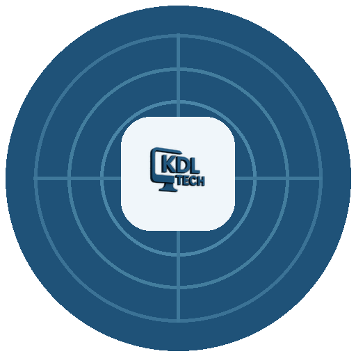
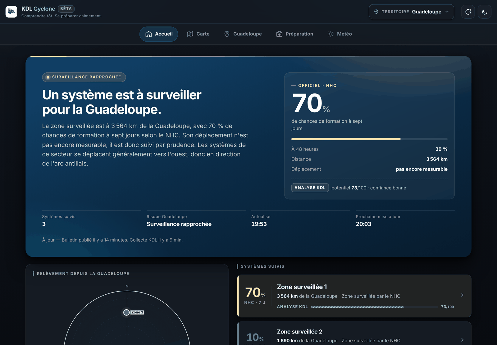
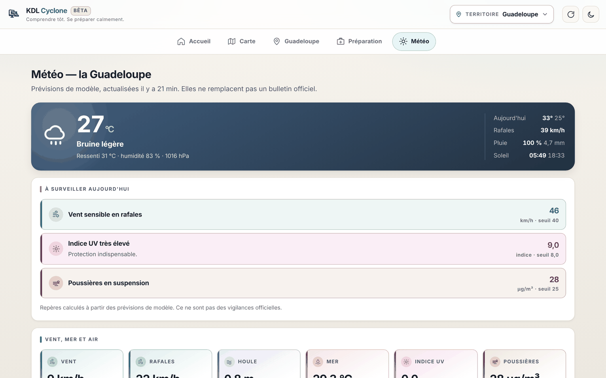
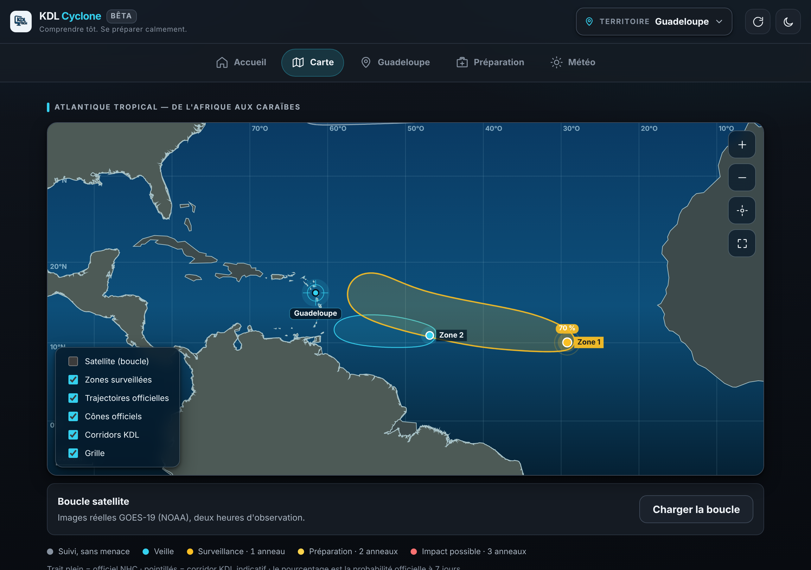
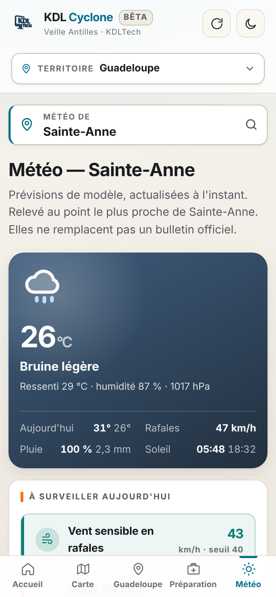
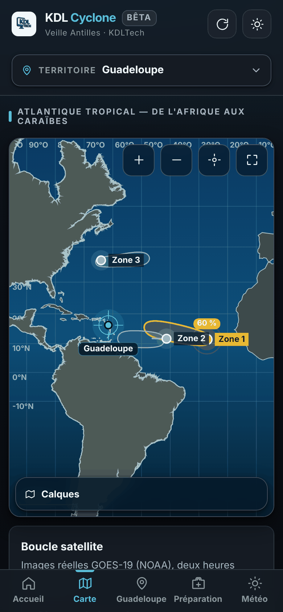

<div align="center">



# KDL Cyclone

**Veille des ondes tropicales et des systèmes cycloniques dans l'Atlantique**
*Tropical wave and cyclone tracking for the Atlantic*

[](CHANGELOG.md)
[](https://github.com/Kdl-Tech/kdl-cyclone/actions/workflows/tests.yml)
[](https://cyclone.kdl-tech.fr/)
[](package.json)
[](https://cyclone.kdl-tech.fr/beta)

### [→ Essayer l'application](https://cyclone.kdl-tech.fr/)

Gratuite · Sans compte · Sans publicité · Installable · Fonctionne hors connexion

</div>

---

> **KDL Cyclone est une application indépendante développée par KDLTech. Elle ne
> constitue pas un service météorologique officiel.** En situation de menace,
> consultez toujours Météo-France, le National Hurricane Center, les préfectures
> et les autorités locales.
>
> *KDL Cyclone is an independent application by KDLTech. It is not an official
> weather service. In a threatening situation, always follow Météo-France, the
> National Hurricane Center, and your local authorities.*

---

<div align="center">

| Thème clair | Thème sombre |
|:---:|:---:|
|  |  |
|  |  |




</div>

---

## Français

### Pourquoi cette application

Chaque saison, la même scène se répète aux Antilles : une onde quitte l'Afrique,
les captures d'écran circulent, les commentaires s'emballent, et personne ne sait
si le système va se creuser ou se dissoudre. L'information officielle existe,
elle est excellente — mais elle est en anglais, technique, et dispersée.

KDL Cyclone rassemble ce qui est publié, le traduit, le date, et sépare
rigoureusement ce qui est officiel de ce qui est une estimation.

### Cinq notions à ne jamais confondre

L'application les distingue par la couleur **et** par la forme, parce que les
mélanger est la première cause de fausse alerte :

| Notion | Ce que c'est | Origine |
|---|---|---|
| **Probabilité de formation** | Chances qu'une zone devienne un cyclone nommé, à 48 h et 7 jours | National Hurricane Center — **officiel** |
| **Intensité actuelle** | Vent maximal soutenu et pression du système existant | National Hurricane Center — **officiel** |
| **Risque d'impact local** | Ce que ce système implique pour le territoire choisi | Calcul KDL — **estimation** |
| **Vigilance officielle** | Le niveau déclaré par l'autorité compétente | Météo-France, préfectures, services nationaux — **officiel** |
| **Indice KDL** | Potentiel de développement noté sur 100, à partir de neuf facteurs météo | Analyse KDL — **expérimental** |

Les trois premières lignes sont des faits ou des dérivés de faits. Les deux
dernières ne sont **jamais** présentées comme officielles : l'indice KDL porte
partout une étiquette violette, une barre hachurée et la mention
« expérimental ».

### Ce que fait l'application

- **Situation générale** — zones suivies, probabilités officielles, distance et
  relèvement depuis le territoire choisi.
- **Carte de l'Atlantique tropical** — zones surveillées, cônes et trajectoires
  officiels, corridor indicatif KDL en pointillés, boucle satellite GOES-19
  réelle, plein écran.
- **Neuf territoires** — Guadeloupe, Saint-Martin, Saint-Barthélemy, Martinique,
  Dominique, Sainte-Lucie, Barbade, Antigua-et-Barbuda, Trinité-et-Tobago.
  Chacun avec **ses** autorités : Météo-France ne couvre pas les îles
  indépendantes, et l'application ne fait jamais semblant du contraire.
- **Météo locale** — conditions du moment, courbe horaire, dix jours, mer,
  houle, UV, qualité de l'air et brume de sable.
- **Mode préparation** — liste de vérification qui fonctionne sans connexion.
- **Hors connexion** — le dernier état connu reste consultable, clairement daté.

### Installation locale

Aucune dépendance à installer : le serveur, le lecteur de shapefile, le lecteur
ZIP et la carte sont écrits à la main en Node natif.

```bash
git clone https://github.com/Kdl-Tech/kdl-cyclone.git
cd kdl-cyclone
node demarrer.mjs
# → http://127.0.0.1:4240
```

Node 20 ou supérieur. La première collecte prend quelques secondes ; les données
atterrissent dans `data/`, qui n'est pas versionné.

```bash
npm test                                              # 128 tests unitaires
node --experimental-websocket scripts/qa-responsive.mjs   # 8 formats, 2 thèmes
node --experimental-websocket scripts/qa-pwa-cycle.mjs    # cycle de vie PWA
node scripts/qa-firefox.mjs                               # autre moteur de rendu
python3 scripts/audit-secrets.py --historique             # recherche de secrets
```

### Architecture

```
server.js          serveur HTTP natif : API, rendu des métadonnées, en-têtes
demarrer.mjs       point d'entrée réel (server.js expose, il n'écoute pas)
src/
  collector.js     orchestration d'une collecte, dégradation gracieuse
  sources/         NHC, Open-Meteo, satellite GOES — un module par source
  engine/          analyse du potentiel, évaluation de la menace territoriale
  territoires.js   les neuf territoires et leurs autorités respectives
  store.js         persistance JSON atomique, historique borné
public/
  js/app.js        interface : rendus, navigation, cycle de vie PWA
  js/carte.js      carte canvas, projection Mercator, aucune tuile tierce
  js/graphiques.js tracés météo en SVG écrit à la main
  sw.js            service worker : coquille, hors connexion, mises à jour
docs/              méthode d'analyse, sources, direction artistique
```

Choix structurants, déjà tranchés :

- **zéro dépendance d'exécution** — aucune surface d'attaque héritée d'un paquet
  tiers, et rien à mettre à jour en urgence un dimanche de saison cyclonique ;
- **aucun service cartographique en ligne** — pas de coût, pas de tuiles
  tierces, aucune position d'utilisateur envoyée ailleurs, et la carte reste
  disponible hors connexion ;
- **JSON atomique plutôt que SQLite** — le build natif est bloqué par la
  politique `ignore-scripts` de KDLTech, et `node:sqlite` n'existe pas en
  Node 20.

### Sources de données

Détail complet, licences et fréquences : [`docs/SOURCES.md`](docs/SOURCES.md).

| Source | Usage | Licence |
|---|---|---|
| [NHC / NOAA](https://www.nhc.noaa.gov/) | Zones surveillées, probabilités, cônes, trajectoires | Domaine public |
| [GOES-19 / NOAA NESDIS](https://www.star.nesdis.noaa.gov/goes/) | Boucle satellite | Domaine public |
| [Open-Meteo](https://open-meteo.com/) | Météo, mer, qualité de l'air | CC BY 4.0 |
| [Natural Earth](https://www.naturalearthdata.com/) | Fond de carte | Domaine public |
| [Météo-France](https://vigilance.meteofrance.fr/) | Lien vers les vigilances officielles | Lien uniquement, aucune donnée reprise |

Aucune donnée propriétaire n'est redistribuée. Les fichiers de prévision
volumineux ne sont jamais versionnés.

### Limites connues

- L'indice KDL est **expérimental**. Il n'a pas été validé statistiquement
  contre l'historique des saisons passées.
- Pas de vent animé ni de convection : une couche de particules honnête exige
  une grille GRIB2, non encore décodée. Aucune particule décorative ne sera
  ajoutée en attendant.
- Safari iOS n'a pas été testé, faute de matériel.
- Les vigilances officielles ne sont pas reprises dans l'application : elles
  sont liées, jamais recopiées.

### Feuille de route

- Décodage GRIB2 pour une couche de vent réellement alimentée
- Sélecteur de canal satellite (infrarouge, vapeur d'eau — déjà prêts côté serveur)
- Fiche système en feuille glissante sur téléphone
- Notifications d'alerte, sous réserve d'un consentement explicite

---

## English

**KDL Cyclone** tracks tropical waves and cyclonic systems across the Atlantic
for the Lesser Antilles. It gathers official National Hurricane Center bulletins,
translates them into French, timestamps everything, and keeps a strict line
between official data and its own experimental analysis.

Nine territories are covered, each with **its own** authorities — Météo-France
does not cover the independent islands, and the app never pretends otherwise.

It is a progressive web app: installable, usable offline, free, with no account
and no advertising. No runtime dependency, no third-party map tiles, no user
location ever leaving the device.

```bash
git clone https://github.com/Kdl-Tech/kdl-cyclone.git
cd kdl-cyclone && node demarrer.mjs      # http://127.0.0.1:4240
npm test
```

The **KDL index** is an experimental development-potential score. It is never
presented as official, and carries a purple label, a hatched bar and an
"expérimental" mention everywhere it appears.

---

## Contribuer, sécurité, historique

- [`CONTRIBUTING.md`](CONTRIBUTING.md) — comment proposer une correction
- [`SECURITY.md`](SECURITY.md) — signaler une faille, périmètre, engagement
- [`CHANGELOG.md`](CHANGELOG.md) — historique des versions
- [`docs/METHODE.md`](docs/METHODE.md) — comment l'indice KDL est calculé
- [`docs/DIRECTION_ARTISTIQUE.md`](docs/DIRECTION_ARTISTIQUE.md) — règles visuelles

## Accessibilité

Contrastes vérifiés au ratio WCAG AA dans les deux thèmes, sur les dix-neuf
teintes claires et les dix-huit sombres. Cibles tactiles de 44 px minimum,
plancher typographique de 11 px, aucun débordement horizontal de 320 à 1920 px,
navigation au clavier avec focus visible, `prefers-reduced-motion` respecté,
aucune information portée par la seule couleur — le niveau de menace se lit
aussi au nombre d'anneaux sur la carte.

Vérifié automatiquement par `scripts/qa-responsive.mjs` : 450 contrôles sur huit
formats et deux thèmes.

## Droits

**Copyright © 2026 KDLTech — Karim De Lucia, Les Abymes, Guadeloupe.
Tous droits réservés.**

Ce code est publié pour être **consultable**, pas pour être réutilisé : chacun
peut vérifier comment les données officielles sont traitées et comment l'analyse
expérimentale est calculée. Aucune licence d'utilisation, de modification ou de
redistribution n'est accordée à ce stade — voir [`LICENSE`](LICENSE).

Le nom, le logo et l'identité KDLTech ne peuvent pas être utilisés par un projet
tiers.

<div align="center">

Conçue en Guadeloupe par **[KDLTech](https://kdl-tech.fr)**

</div>
